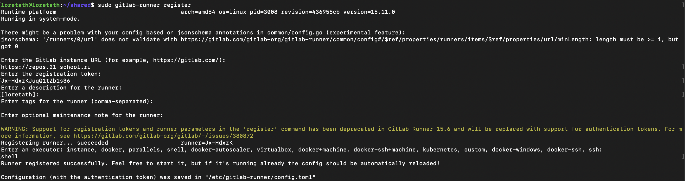
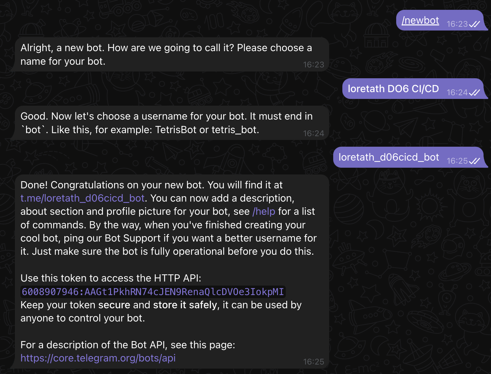

# Basic CI/CD

Разработка простого **CI/CD** для проекта *SimpleBashUtils*. Сборка, тестирование, развертывание.


## Contents

1. [Настройка gitlab-runner](#part-1-настройка-gitlab-runner)  
2. [Сборка](#part-2-сборка)  
3. [Тест кодстайла](#part-3-тест-кодстайла)   
4. [Интеграционные тесты](#part-4-интеграционные-тесты)  
5. [Этап деплоя](#part-5-этап-деплоя)  
6. [Дополнительно. Уведомления](#part-6-дополнительно-уведомления)

## Part 1. Настройка **gitlab-runner**

1. Добавим официальный репозиторий.

```bash
curl -L "https://packages.gitlab.com/install/repositories/runner/gitlab-runner/script.deb.sh" | sudo bash
```

2. Установим последнюю версию GitLab Runner.

```bash
sudo apt-get install gitlab-runner
```

3. Сделаем автозапуск сервиса и запустим его.

```bash
# разрешаем автозапуск сервиса и стартуем его
systemctl enable gitlab-runner --now
```

4. Зарегистрируем runner. При регистрации теги не создавала, чтобы запускать задачи без тегов. Иначе все задачи должны будут запускаться с тегами. В качестве исполнителя выбран shell, так как в CI буду запускать shell-команды.

```bash
sudo gitlab-runner register
```




## Part 2. Сборка

- В .gitlab-ci.yml пропишем стейджи и цели для сборки:

```yml
stages:
  - build
  - test_style
  - integration_test
  - deploy

build-cat:
  stage: build
  script:
    - cd src/project/cat/ && make build
  artifacts:
    paths: 
      - src/project/cat/s21_cat
    expire_in: 30 days

build-grep:
  stage: build
  script:
    - cd src/project/grep/ && make build
  artifacts:
    paths:
      - src/project/grep/s21_grep
    expire_in: 30 days
```
## Part 3. Тест кодстайла

- Для проверки на стиль кода важно, чтобы на сервере соответствующая утилита была установлена.

```bash
sudo apt-get install clang-format
```

- В .gitlab-ci.yml пропишем цели для теста на код-стайл. Также важно указать зависимость от предыдущего этапаи запуск в случае, если предыдущая стадия была выполнена успешно.

```yml
style-cat:
  stage: test_style
  needs: ["build-cat"]
  script: 
    - cd src/project/cat/ && clang-format -n -Werror *.c
  when: on_success

style-grep:
  stage: test_style
  needs: ["build-grep"]
  script: 
    - cd src/project/grep/ && clang-format -n -Werror *.c
  when: on_success
```


## Part 4. Интеграционные тесты

- В .gitlab-ci.yml пропишем цели для запуска тестов. Также важно указать зависимость от предыдущего этапаи запуск в случае, если предыдущая стадия была выполнена успешно.

```yml
test-cat:
  stage: integration_test
  needs: ["build-cat", "style-cat"]
  script: 
    - cd src/project/cat/ && make test
  when: on_success

test-grep:
  stage: integration_test
  needs: ["build-grep", "style-grep"]
  script: 
    - cd src/project/grep/ && make test
  when: on_success
```

- Сам тестовый скрипт возвращает 0 в случае успешного выполения всех тестов и 1 в случае ошибки.

## Part 5. Этап деплоя

> Для деплоя была поднята вторая виртуальная машина, играющая роль продакшена. На нее будут поставляться исполняемые файлы после того, как приложение собралось и прошло все проверки успешно.

- Для автоподстановки паролей установим на машине с гитлаб-раннером из предыдущих пунктов утилиту expect.

```bash
sudo apt-get install -y expect
```

- Этап деплоя в .gitlab-ci.yml:

```yml
deploy:
  stage: deploy
  needs: ["build-cat", "build-grep", "style-cat", "style-grep", "test-cat", "test-grep"]
  script: 
    - cd src && bash deploy.sh
  when: on_success
```

- Скрипт deploy.sh запускает transfer_files.exp, в котором происходит перенос файлов с одной машины на другую при помощи scp, а также перенос полученных машиной 2 файлов в папку /usr/local/bin/ при помощи ssh:

```bash
#!bin/bash
expect transfer_files.exp
```

- transfer_files.sh:
```bash
#!bin/expect -f

set PASSWD "123"
set CAT_FILE_FOR_COPY "/home/gitlab-runner/builds/xef_mJQq/0/students/DO6_CICD.ID_356283/loretath_student.21_school.ru/DO6_CICD-1/src/project/cat/s21_cat"
set GREP_FILE_FOR_COPY "/home/gitlab-runner/builds/xef_mJQq/0/students/DO6_CICD.ID_356283/loretath_student.21_school.ru/DO6_CICD-1/src/project/grep/s21_grep"
set SCRIPT_TO_MOVE_FILES "/home/gitlab-runner/builds/xef_mJQq/0/students/DO6_CICD.ID_356283/loretath_student.21_school.ru/DO6_CICD-1/src/move_files.sh"
set USER_ON_SERVER "loretath"
set SERVER_IP "192.168.100.10"
set DEST_PATH "/home/loretath/"

# Перенос файлов с одной машины на другую
spawn scp $CAT_FILE_FOR_COPY $USER_ON_SERVER@$SERVER_IP:$DEST_PATH
expect {
    "*yes/no*" {
    send -- "yes\r"
    exp_continue
    }
    "*password*" {
    send -- "$PASSWD\r"
    exp_continue
    }
}
spawn scp $GREP_FILE_FOR_COPY $USER_ON_SERVER@$SERVER_IP:$DEST_PATH
expect {
    "*yes/no*" {
    send -- "yes\r"
    exp_continue
    }
    "*password*" {
    send -- "$PASSWD\r"
    exp_continue
    }
}

# Перенос файлов на удаленной машине. Через ssh с первой и на первой машине запускается скрипт на второй.
# В $SCRIPT_TO_MOVE_FILES команды, которые будут запущены на второй машине.
spawn $env(SHELL)
send -- "ssh loretath@192.168.100.10 'echo $PASSWD | sudo -Sv && bash -s' < $SCRIPT_TO_MOVE_FILES\n"
expect {
    "*yes/no*" {
    send -- "yes\r"
    exp_continue
    }
    "*password*" {
    send -- "$PASSWD\r"
    exp_continue
    }
}
```
- move_files.sh:
```bash
#!bin/bash

SRC_PATH="/home/loretath"
DEST_PATH="/usr/local/bin/"

sudo mv $SRC_PATH/s21_cat $DEST_PATH
sudo mv $SRC_PATH/s21_grep $DEST_PATH

exit
```
## Part 6. Дополнительно. Уведомления

1. Пишем @BotFather'y в Телеграмме:



2. Открываем своего бота, стартуем его. Переходим на

```bash
https://api.telegram.org/bot<TOKEN>/getUpdates
или
curl https://api.telegram.org/bot<TOKEN>/getUpdates
```

- Из полученного текста вытаскиваем id чата (CHAT_ID).

3. Теперь можно отправлять любое сообщение из BASH или из браузера:

```bash
https://api.telegram.org/bot<TOKEN>/sendMessage?chat_id=<CHAT_ID>&text=Hello%20World
или
curl -s -X POST https://api.telegram.org/bot<TOKEN>/sendMessage -d chat_id=<CHAT_ID> -d text="Hi"
```

4. Напишем telegram.sh, в котором настроим отправку уведомлений.

```bash
TELEGRAM_BOT_TOKEN="6008907946:AAGt1PkhRN74cJEN9RenaQlcDVOe3IokpMI"
TIME=5
CHAT_ID=637830245
URL="https://api.telegram.org/bot$TELEGRAM_BOT_TOKEN/sendMessage"

TEXT="Job: $CI_JOB_NAME%0AStage: $CI_JOB_STAGE%0AStatus: $CI_JOB_STATUS%0A%0AProject:+$CI_PROJECT_NAME%0AURL:+$CI_PROJECT_URL/pipelines/$CI_PIPELINE_ID/%0ABranch:+$CI_COMMIT_REF_SLUG"
curl -s --max-time $TIME -d "chat_id=$CHAT_ID&disable_web_page_preview=1&text=$TEXT" $URL > /dev/null
```
5. В .gitlab-ci.yml добавим вызов скрипта для каждого этапа.

```yml
...
  after_script:
    - bash src/telegram.sh
...
```